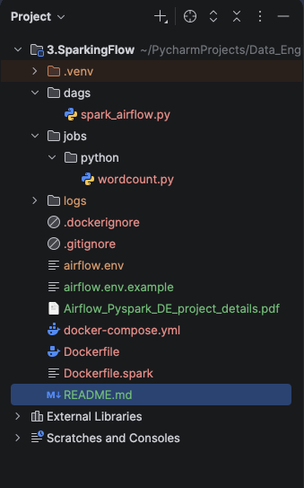

# Spark + Airflow Standalone Cluster

A production-ready Docker Compose setup for **Apache Spark 4.0** + **Apache Airflow 2.10.3** with **PySpark 4.0** support.

## Features

- Spark Standalone Cluster (1 Master + 2 Workers)
- Airflow 2.10.3 with Python 3.12
- PySpark 4.0.0 integration via `SparkSubmitOperator`
- Apple Silicon (arm64) compatible
- Clean separation of Spark and Airflow environments

## Project Structure



## Getting Started

### 1. Clone the Repository

```bash
git clone https://github.com/YOUR_USERNAME/spark-airflow-standalone.git
cd spark-airflow-standalone
```

### 2. Create Environment File
```bash
cp airflow.env.example airflow.env
(edit airflow.env.example to airflow.env and update the SECRET_KEY.)
```

### 3. Build and Start the Cluster
```bash
docker compose down -v --remove-orphans
docker compose build --no-cache
docker compose up -d
```

### 4. Access the UIs

- Service,URL,Credentials
- Airflow UI,http://localhost:8080,admin / admin
- Spark Master UI,http://localhost:9090,

### 5. Running the Example DAG
1. Go to Airflow UI → Admin → Connections
2. Create a new connection:
   - Conn Id: spark-conn
   - Conn Type: Spark
   - Spark Binary: spark-submit
   - Master: spark://spark-master:7077
3. Trigger the DAG named sparking_flow

### Tech Stack

- Apache Spark 4.0.0 (Standalone)
- Apache Airflow 2.10.3
- PySpark 4.0.0
- PostgreSQL 14
- Python 3.12

### Notes

- This setup is used by me for development and learning.
- For production, consider using Kubernetes or managed services (EMR, Databricks, etc.).
- Please refer Airflow_Pyspark_DE_project_details.pdf for project details
---
